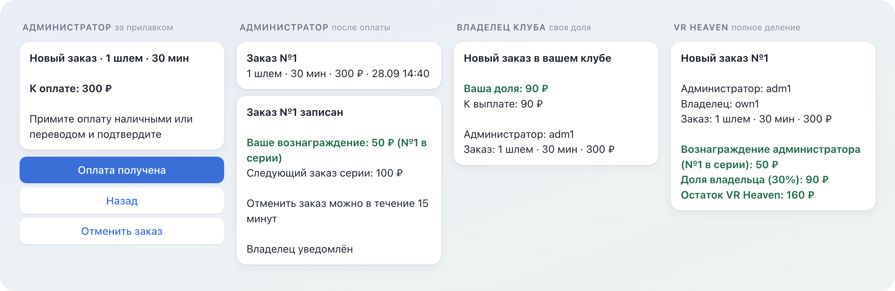

<p align="center">
  Telegram-бот учёта VR-сеансов в компьютерных клубах: администратор оформляет заказ кнопками, а бот делит выручку между администратором, владельцем клуба и VR Heaven до копейки.
</p>

<p align="center">
  
  
  
  
  
  
</p>

<p align="center">
  
</p>

<p align="center">
  Один заказ глазами трёх ролей. Тексты - настоящий вывод бота из тестового стенда.
</p>

## Применение

VR Heaven ставит VR-зоны в компьютерные клубы. Деньги за сеанс принимает администратор клуба, наличными или переводом, а часть выручки полагается ему, владельцу клуба и VR Heaven. Бот заменяет этот учёт: фиксирует каждый оплаченный сеанс, замораживает деление в момент оформления и ведёт выплаты. Это журнал учёта, а не платёжная система: деньги через бота не проходят.

## Возможности

- **Три роли, три кабинета.** Администратор видит только свои заказы и вознаграждение, владелец - только свою долю, VR Heaven - полное деление, сводку и управление.
- **Заказ только кнопками.** Цена выводится из настроек в момент показа экрана оплаты: базовая цена, скидка по расписанию, округление до 10 рублей. Свободного ввода, влияющего на деньги, нет.
- **Точное деление.** Вознаграждение администратора по лесенке 12-часовой серии (50, 100, 150, 200, 250 рублей), доля владельца в процентах, остаток VR Heaven. Три части всегда дают ровно цену заказа.
- **Выплаты.** Стороны заказа закрываются независимо; выплата проводится одной транзакцией, двойное нажатие и гонка двух супер-админов дают ровно одну выплату. Плановые дни 10-е и 25-е, бонусы и удержания с обязательным комментарием.
- **Отмена.** Администратор отменяет свой заказ в течение 15 минут, VR Heaven - любой; отмена мягкая, идемпотентная, с уведомлением всех сторон.
- **Настройки без кода.** Цены сеансов, расписание скидки, акции-призы и бесплатные 15 минут меняет VR Heaven прямо в боте.
- **Аудит и экспорт.** Каждое денежное и административное действие пишется в журнал с автором; экспорт CSV для VR Heaven и для владельца по его данным.

## Архитектура

- **Одно Окно и Записи.** В чате ровно одно сообщение с кнопками, которое правится на месте. Уведомления - Записи без кнопок, которые не удаляются никогда; при появлении Записи Окно переставляется под неё вместе с состоянием сценария.
- **Транзакционная очередь доставки.** Уведомление ставится в очередь в той же транзакции, что и изменение: откатилась операция - уведомлений нет, записалась - доставка гарантирована, с повторами через перезапуски.
- **SQLite как единственное хранилище.** Одно соединение, WAL, запись только внутри `BEGIN IMMEDIATE` под общим локом. Состояние сценариев тоже в базе и переживает перезапуск.
- **Версионируемая схема.** Миграции по `PRAGMA user_version` с пост-условиями; перед миграцией снимается отдельная копия, база новее программы - отказ старта.
- **Копии с проверкой.** Ежедневная копия `VACUUM INTO` проверяется целостностью и деловыми инвариантами до публикации, ротация по дням, неделям и месяцам, еженедельная проверка восстановимости.
- **Эксплуатация.** systemd-юнит под отдельным пользователем, токен через `LoadCredential`, развёртывание по тегам с прогоном миграций на копии боевой базы и откатом: [deploy/RUNBOOK.md](deploy/RUNBOOK.md).

Правила системы целиком описаны в [SPEC.md](SPEC.md).

## Требования

- Python 3.12
- [uv](https://docs.astral.sh/uv/)
- Токен бота от @BotFather; для разработки - отдельный бот, не боевой

## Запуск

```bash
git clone https://github.com/TihonSotnikov/VrHeaven-VrZoneBot.git
cd VrHeaven-VrZoneBot
uv sync
cp .env.example .env
```

В `.env` обязательны `BOT_TOKEN` и `ADMIN_IDS` (Telegram ID супер-админов через запятую); остальные параметры описаны в самом `.env.example`.

```bash
uv run python main.py
```

При первом запуске создаётся база `adminbot.db` со всеми миграциями.

## Тестирование

```bash
uv run pytest -q
uv run ruff check .
```

617 тестов без обращения к Telegram: тестовый двойник Bot API проверяет каждое отправленное сообщение на длину, корректность HTML-разметки и лимиты клавиатуры. Те же проверки выполняются в GitHub Actions на каждый push.
