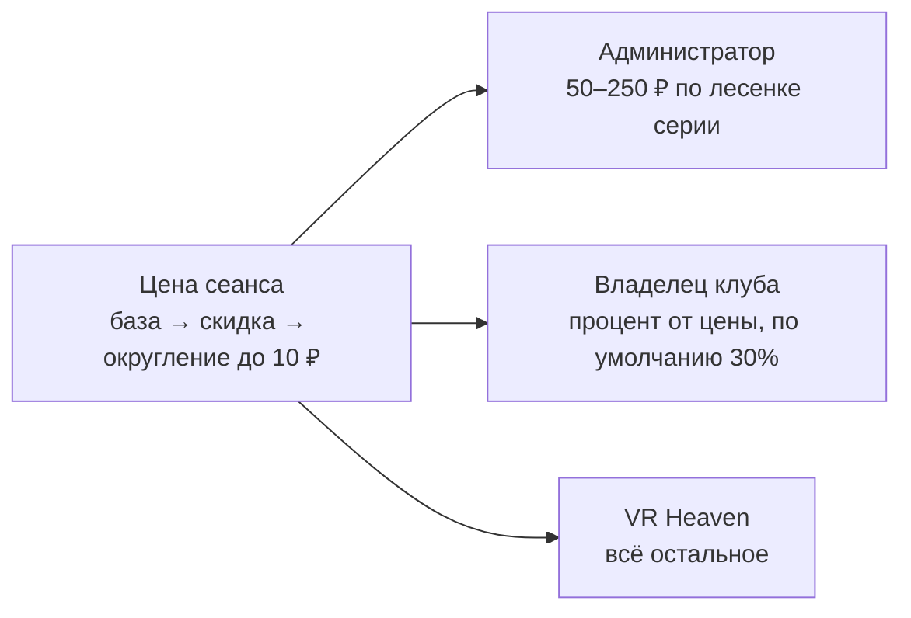

<div align="center">

# VR Heaven — VR Zone Bot

**Телеграм-бот учёта VR-сеансов в компьютерных клубах**

[](https://github.com/TihonSotnikov/VrHeaven-VrZoneBot/actions/workflows/ci.yml)


</div>

VR Heaven ставит VR-зоны в компьютерные клубы. Администратор клуба
оформляет в боте оплаченный сеанс в несколько нажатий, а бот считает,
кто кому сколько должен: вознаграждение администратора, долю владельца
клуба и остаток VR Heaven.

Это личный проект бренда VR Heaven. Бот работает в проде.

## Что умеет бот

Бот ведёт учёт, но не принимает платежи. Деньги клиент отдаёт
администратору наличными или переводом, а бот фиксирует, что сеанс
состоялся, и держит расчёты в порядке.

| Роль | Кто это | Что делает в боте |
|---|---|---|
| **Администратор** | сотрудник клуба у прилавка | оформляет заказ кнопками, видит своё вознаграждение, может отменить свой заказ в течение 15 минут |
| **Владелец** | хозяин компьютерного клуба | получает долю с заказов своих администраторов, видит текущий период, историю выплат, выгружает CSV |
| **VR Heaven** | супер-админы | заводят учётные записи, задают цены, скидки и акции, проводят выплаты, отменяют заказы, смотрят сводку |

**Как делятся деньги.** Каждый заказ сразу делится на три части, и
сумма частей всегда равна цене до копейки:



- **Лесенка вознаграждения.** Чем больше заказов у администратора за
  12-часовую смену, тем больше он получает за каждый следующий: 50,
  100, 150, 200, затем 250 ₽.
- **Цена фиксируется при показе.** Сумма, которую назвали клиенту, при
  подтверждении не пересчитывается.
- **Выплаты.** Выплата закрывает период получателя. 10-го и 25-го бот
  напоминает, кому сколько положено. Сами деньги переводит человек.
- **Акции** — это призы колеса фортуны. У них нет денежной величины,
  поэтому на расчёты они не влияют.
- **Уведомления.** Чек о каждом заказе приходит администратору,
  владельцу и VR Heaven. Панель VR Heaven можно открыть и в теме
  общей группы.
- **Автоматика.** Копия базы каждую ночь проверяется и уходит
  супер-админам. Раз в неделю бот проверяет, что копия
  восстанавливается. По `/system` бот показывает своё состояние.

Все правила подробно описаны в [SPEC.md](SPEC.md).

## Документация

| Документ | Для кого | О чём |
|---|---|---|
| [SPEC.md](SPEC.md) | разработчик, заказчик | что бот обязан делать: роли, деньги, правила интерфейса |
| [guides/](guides/) | пользователи | «Как пользоваться» для [администратора](guides/admin.md), [владельца](guides/owner.md) и [VR Heaven](guides/superadmin.md) |
| [deploy/RUNBOOK.md](deploy/RUNBOOK.md) | эксплуатация | как поднять, обновить, откатить и восстановить бота |
| [docs/MANUAL_TEST_GUIDE.md](docs/MANUAL_TEST_GUIDE.md) | приёмка | ручная проверка на трёх живых аккаунтах |
| [docs/](docs/) | история | аудит и план приведения бота в боевое состояние |

## Быстрый старт

Нужны [uv](https://docs.astral.sh/uv/) и Python 3.12.

```bash
uv sync
cp .env.example .env      # впишите токен своего тестового бота и свой Telegram ID
uv run main.py
```

**Для разработки нужен отдельный бот.** Telegram отдаёт апдейты только
одному получателю, поэтому запуск с боевым токеном заберёт их у сервера.

## Устройство

```
main.py          запуск: блокировка каталога, копия базы, миграции, диспетчер
config.py        конфигурация из окружения и секретов systemd
db.py            соединение, транзакции и репозитории
migrations.py    версионированные миграции (PRAGMA user_version)
fsm_storage.py   состояние сценариев в SQLite
messaging.py     Окно и Записи: единственная точка отправки сообщений
outbox.py        долговечная доставка Записей
notify.py        постановка Записей в очередь внутри бизнес-транзакции
delivery.py      темп исходящих запросов и повторы; входящее ограничение
markup.py        сборка текста: экранирование по построению и граница длины
keyboards.py     клавиатуры
pricing.py       цена, скидка, лесенка вознаграждения, серии
reports.py       отчёты, не зависящие от способа показа
export.py        выгрузки CSV
backup.py        копии: снять, проверить, ротировать, выгрузить, восстановить
invariants.py    проверка деловых инвариантов над любым файлом базы
scheduler.py     плановые задачи
errors.py        разбор нажатий и общий обработчик ошибок
logs.py          журналирование с контекстом
roster.py        список супер-админов
handlers/        сценарии: common (общее), vrheaven (панель), staff (кабинеты)
guides/          инструкции «Как пользоваться» для каждой роли
deploy/          юнит systemd, развёртывание, откат, их стенд, runbook
tests/           тесты
```

### Три решения, на которых держится остальное

**Запись возможна только в транзакции.** Изменяющие методы `db` требуют
`tx`, а получить его можно только так:

```python
async with db.write() as tx:            # BEGIN IMMEDIATE под общим локом
    order, created = await db.create_order(tx, ...)
    await db.audit(tx, actor, "order.create", "order", order["id"], ...)
    await notify.to_user(db, tx, owner, text, kind="order_owner", dedup=...)
# здесь COMMIT; при исключении ROLLBACK, частичных записей не бывает
```

Заказ, запись в журнал действий и уведомления коммитятся вместе. Место в
лесенке считается в той же транзакции, поэтому два устройства одного
кабинета получают ступени 1 и 2. Повтор формы отсекает уникальный
`client_token`, а не удачное совпадение.

**В чате одно Окно и сколько угодно Записей.** Кнопки есть только у
одного сообщения — Окна. Всё остальное (чеки, уведомления, отчёты,
копии, выгрузки) остаётся в чате навсегда. Когда появляется новая
Запись, Окно переставляется под неё вместе с содержимым и кнопками,
поэтому экран оплаты не теряется. Новое Окно отправляется **до**
удаления старого. Бот удаляет только две вещи: своё Окно и сообщение
пользователя. По `/start` Окно ставится заново: если пользователь
очистил чат, правка старого Окна пройдёт успешно, но её увидит только
Telegram.

**Текст собирается так, что сломать его нечем.** Шаблон пишем мы, а
значения экранирует функция `h()`. Забыть про экранирование нельзя:
другого способа подставить значение нет. Длина ограничивается ещё до
отправки и режется по границе тега.

## Тесты

```bash
uv run pytest -q
uv run ruff check .
```

Тесты проверяют не только логику, но и контракт Telegram. Каждая
отправка разбирается на теги, длину и клавиатуру, поэтому сообщение,
которое Telegram отверг бы, роняет тест прямо в месте отправки.
Одновременные действия проверяются настоящим `Dispatcher` с настоящим
хранилищем состояния, а не его моделью. На каждый пуш тесты и линтер
запускает GitHub Actions.

Деловые инварианты можно проверить и отдельно, на любом файле базы:

```bash
uv run python invariants.py /путь/к/adminbot.db
```

## Настройки окружения

| Переменная | Смысл | По умолчанию |
|---|---|---|
| `BOT_TOKEN` | токен бота | — (обязательна) |
| `BOT_TOKEN_FILE` | файл с токеном вместо переменной | — |
| `ADMIN_IDS` | Telegram ID супер-админов через запятую | — (обязательна) |
| `TIMEZONE` | часовой пояс расписаний | `Europe/Moscow` |
| `DB_PATH` | файл базы | `adminbot.db` |
| `DATA_DIR` | каталог данных (блокировка, копии) | каталог базы |
| `BACKUP_DIR` | каталог копий | `DATA_DIR/backups` |
| `BACKUP_KEEP_DAYS` / `_WEEKS` / `_MONTHS` | ротация копий | 7 / 8 / 12 |
| `BACKUP_OFFHOST_CMD` | команда выгрузки копии, `{path}` и `{name}` | не задана |
| `SUPERADMIN_CHAT_ID` | группа супер-админов, где тоже открывается панель | не задана |
| `SUPERADMIN_TOPIC_ID` | тема этой группы; вне неё бот в группе молчит | не задана |
| `LOG_JSON`, `LOG_LEVEL` | журналирование | `false`, `INFO` |

На сервере токен приходит через `LoadCredential` systemd и в окружении
процесса не появляется.

## Данные

Все данные лежат в одном файле SQLite в режиме WAL. Версия схемы
хранится в `PRAGMA user_version`. Миграции атомарны, проверяют
результат и перед началом снимают неизменяемую копию. Если база новее
программы, бот не запускается: откат релиза поверх новой схемы должен
быть заметен сразу.

Таблицы: `users`, `user_chats`, `orders`, `promos`, `bonuses`, `payouts`,
`settings`, `super_admins`, `audit_log`, `outbox`, `chat_windows`,
`fsm_state`.

## Стек

Python 3.12 · [aiogram 3](https://docs.aiogram.dev/) · aiosqlite ·
APScheduler · uv · long polling · systemd
